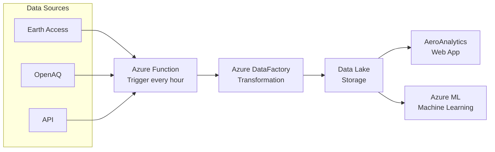

# TEMPO Data Analysis Script

## Overview
The `tempo.py` script is designed to process and analyze TEMPO (Tropospheric Emissions: Monitoring of Pollution) satellite data. It extracts air quality measurements for various pollutants across North America and calculates Air Quality Index (AQI) values.

## Data Extraction Process

The following diagram illustrates the complete data pipeline architecture:



This pipeline demonstrates how data flows from multiple sources (Earth Access, OpenAQ, and other APIs) through an hourly-triggered Azure Function, gets transformed by Azure DataFactory, stored in a Data Lake, and then consumed by both the AeroAnalytics web application and Azure Machine Learning services.

## Features
- Extracts NO2, O3, and HCHO data from TEMPO satellite measurements
- Calculates concentrations in µg/m³
- Computes EPA Air Quality Index (AQI) values
- Supports spatial and temporal data filtering
- Handles multiple regions and time periods
- Exports results to CSV format

## Technical Requirements

### Python Version
- Python 3.8 or higher

### Required Python Packages
```
earthaccess>=0.5.1
netCDF4>=1.6.4
numpy>=1.22.0
pandas>=1.5.0
scipy>=1.9.0
```

### NASA Earthdata Account
- Active NASA Earthdata Login account required
- Credentials must be configured for earthaccess authentication

## Installation

1. Create a virtual environment (recommended):
```bash
python -m venv venv
.\venv\Scripts\activate
```

2. Install required packages:
```bash
pip install -r requirements.txt
```

3. Configure NASA Earthdata credentials:
   - Create an account at https://urs.earthdata.nasa.gov/
   - Run `earthaccess login` in terminal
   - Follow the authentication prompts

## Usage

Basic usage example:
```python
python tempo.py --region "North America" --date "2024-09-01" --output "results.csv"
```

### Command Line Arguments
- `--region`: Target geographical region
- `--date`: Analysis date (YYYY-MM-DD format)
- `--output`: Output file path (CSV format)

## Output Format
The script generates a CSV file containing:
- Timestamp
- Geographical coordinates
- Pollutant concentrations (NO2, O3, HCHO)
- Calculated AQI values
- Air quality categories

## Error Handling
- Handles missing data scenarios
- Provides clear error messages for common issues
- Includes data validation checks

## Performance Considerations
- Requires sufficient RAM for large datasets
- Processing time varies with geographical area
- Network connection needed for data download

## Limitations
- Data availability depends on TEMPO satellite coverage
- Limited to North American continent
- Temporal resolution based on satellite passes

## Support
For issues or questions, please open a GitHub issue or contact the maintainer.
